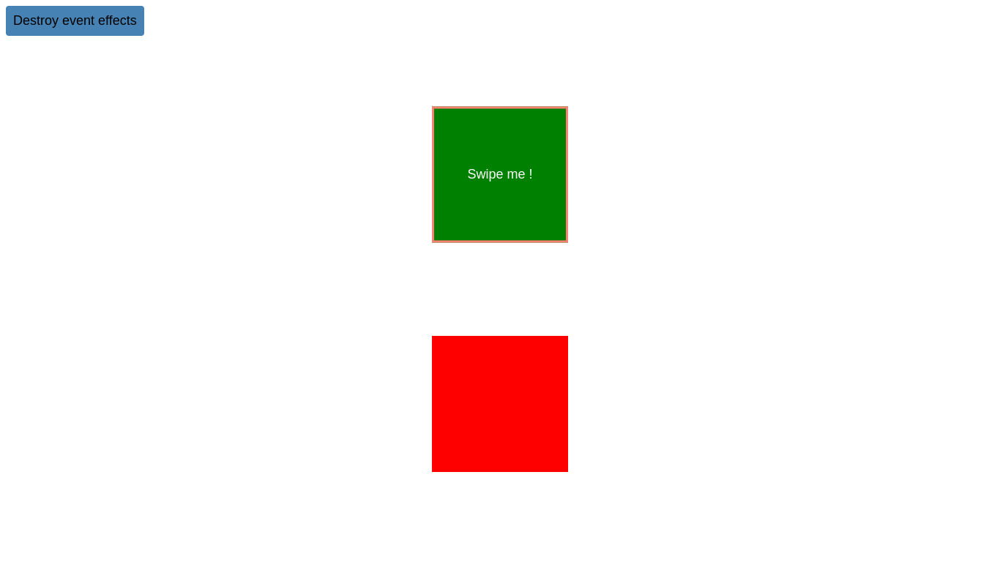
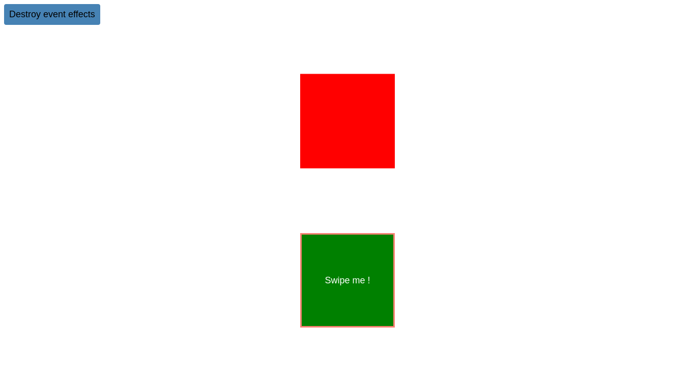

# Swipe Events Manager


This Node Package Manager (<a href = "https://www.npmjs.com/"><i>NPM</i></a>)
is a front-end library for managing touch screen events on mobile devices. It
provides a support for Javascript and Typescript.

## Table of contents
1. [Access links](#links)
2. [References](#refs)
3. [Final result](#result)
4. [Installation](#install)
5. [Get started](#learn)
6. [Sources code](#sources)
    1. [Clonning](#cloning)
    2. [Dependencies installation](#dev-install)
    3. [Running](#running)

## Access links <a id = "links"></a>
An example of use case of the package is already hosted on web and
can be accessible through one of these links below :<br/>
- https://CodiTheck.github.io/swipe_events_manager
- https://obrymec.github.io/swipe_events_manager
- https://obrymec.gitlab.io/swipe_events_manager

## References <a id = "refs"></a>
The package sources can be found via one these links below:
- https://www.npmjs.com/package/@prince-obrymec/swipe-events-manager
- https://github.com/CodiTheck/swipe_events_manager
- https://gitlab.com/obrymec/swipe_events_manager

## Final result <a id = "result"></a>
This is the final result of the project :<br/><br/>



## Installation <a id = "install"></a>
We can install the module via `npm`, `pnpm` or `yarn`. For `npm`,
use the command line below :
```sh
npm install @prince-obrymec/swipe-events-manager --save-dev
```

For `pnpm`, use the command line below :
```sh
pnpm install @prince-obrymec/swipe-events-manager --save-dev
```

For `yarn`, use the command line below :
```sh
yarn add @prince-obrymec/swipe-events-manager --save-dev
```

We can also get the CDN link there :
```html
<script
  src = "https://obrymec.github.io/swipe_events_manager/build/swipe.min.js"
  type = "text/javascript"
></script>
<script
  src = "https://obrymec.github.io/swipe_events_manager/build/swipe.js"
  type = "text/javascript"
></script>

<!--CDN links for CJS support-->
<script
  src = "https://obrymec.github.io/swipe_events_manager/build/cjs/swipe.min.js"
  type = "text/javascript"
></script>
<script
  src = "https://obrymec.github.io/swipe_events_manager/build/cjs/swipe.js"
  type = "text/javascript"
></script>
```

## Get Started <a id = "learn"></a>
Before listen any swipe event, we must create an
object instance of that. Of course, we must also
import the module before any usage.
```js
// Package importation.
import {SwipeEventsManager} from "@prince-obrymec/swipe-events-manager";

// We can create a swipe manager with a tag
// reference.
const swipeManager1 = new SwipeEventsManager (myTagRef);

// We can also create a swipe manager with
// a tag id, class etc...
const swipeManager2 = new SwipeEventsManager ("#my-tag");
```

Notice that when we creating a swipe manager, we can
pass two arguments to that object. The first is the
tag where swipe events will be listened and the
second is a callback method that is triggered when
any swipe event is detected on the selected markup.
The callback fetch the swipe direction for you.
<i><b>Only first argument is required when we
creating an object instance of a swipe events
manager</i></b>.

Now we can rewrite the code above like this :
```js
// Package importation.
import {SwipeEventsManager} from "@prince-obrymec/swipe-events-manager";

// We can create a swipe manager with a tag
// id, class, etc... and a callback method
// to listen upcoming swipe events on the
// selected tag.
const swipeManager = new SwipeEventsManager (
  "#my-tag", function (direction) {
    /** ... */
  }
);
```

We can know the swipe's direction thank the fetched
direction from our callback. The direction is a
constant with the following values :

- <b>SWIPE_UP</b> : Returned when the swipe direction is
to top.
- <b>SWIPE_RIGHT</b> : Returned when the swipe direction
is to right.
- <b>SWIPE_DOWN</b> : Returned when the swipe direction
is to bottom.
- <b>SWIPE_LEFT</b> : Returned when the swipe direction
is to left.

Finally the full source code will be :
```js
// Package importation.
import {
  SwipeEventsManager,
  SwipeEventType
} from "@prince-obrymec/swipe-events-manager";

// We can create a swipe manager with a tag
// id, class, etc... and a callback method
// to listen upcoming swipe events on the
// selected tag.
const swipeManager = new SwipeEventsManager (
  "#my-tag", function (direction) {
    // The selected tag's name.
    const tagName = swipeManager.getTag ().tagName;

    // Whether the direction is right.
    if (direction === SwipeEventType.SWIPE_RIGHT) {
      // Makes a warn on the browser.
      window.alert (`SWIPE RIGHT DETECTED: ${tagName}`);
    }

    // Whether the direction is bottom.
    else if (direction === SwipeEventType.SWIPE_DOWN) {
      // Makes a warn on the browser.
      window.alert (`SWIPE DOWN DETECTED: ${tagName}`);
    }

    // Whether the direction is left.
    else if (direction === SwipeEventType.SWIPE_LEFT) {
      // Makes a warn on the browser.
      window.alert (`SWIPE LEFT DETECTED: ${tagName}`);
    }

    // Whether the direction is top.
    else if (direction === SwipeEventType.SWIPE_UP) {
      // Makes a warn on the browser.
      window.alert (`SWIPE UP DETECTED: ${tagName}`);
    }
  }
);
```

Another way to do that is to use `listen` method provided
by the swipe events manager directly. But use this method
if and only if you don't provide a callback when you
creating a swipe events manager. The code below show
you a use case :
```js
// Package importation.
import {
  SwipeEventsManager,
  SwipeEventType
} from "@prince-obrymec/swipe-events-manager";

// We can create a swipe manager with a tag
// reference.
const swipeManager = new SwipeEventsManager (
  myTagRef
);

// Listens swipe directions.
swipeManager.listen (function (direction) {
  // Whether the direction is right.
  if (direction === SwipeEventType.SWIPE_RIGHT) {
    // Makes a warn on the browser.
    window.alert ("SWIPE RIGHT DETECTED !");
  }

  // Whether the direction is bottom.
  else if (direction === SwipeEventType.SWIPE_DOWN) {
    // Makes a warn on the browser.
    window.alert ("SWIPE DOWN DETECTED !");
  }

  // Whether the direction is left.
  else if (direction === SwipeEventType.SWIPE_LEFT) {
    // Makes a warn on the browser.
    window.alert ("SWIPE LEFT DETECTED !");
  }

  // Whether the direction is top.
  else if (direction === SwipeEventType.SWIPE_UP) {
    // Makes a warn on the browser.
    window.alert ("SWIPE UP DETECTED !");
  }
});
```

The package offers also some additional that are :
```js
// Package importation.
import {SwipeEventsManager} from "@prince-obrymec/swipe-events-manager";

// The old tag reference.
const oldTag = document.querySelector ("#old-tag");
// The new tag reference.
const newTag = document.querySelector ("#new-tag");

// Creating a new object instance of a swipe events manager.
const swipeManager = new SwipeEventsManager (oldTag);

// Returns the current selected tag reference on the manager.
console.log (swipeManager.getTag ());

// Overrides the current selected tag to another. Notice
// that old tag events are destroyed before go to the
// new tag.
swipeManager.setTag (newTag);

// We could also set the active tag by giving the id,
// class, etc... of the new tag directly.
swipeManager.setTag ("#new-tag");

// We can destroy all listened swipe events on the
// active markup.
swipeManager.free ();
```

## Sources code <a id = "sources"></a>
If you want to get package sources code, make sure
to have <i><a href = "https://nodejs.org/en/download">
NodeJs</a></i> already installed in your machine. If
it isn't the case, you can install <i><a href = "https://nodejs.org/en/download">
NodeJs</a></i> through the command lines below :
```sh
cd ~;\
sudo apt install curl;\
curl https://raw.githubusercontent.com/creationix/nvm/master/install.sh | bash;\
source ~/.bashrc;\
nvm --version;\
nvm install --lts;\
node --version;\
npm install yarn --global;\
yarn --version
```

### Cloning <a id = "cloning"></a>
```sh
git clone git@github.com:obrymec/swipe_events_manager.git swipe_events_manager/
```

### Dependencies installation <a id = "dev-install"></a>
Go to the root folder of the project sources and run :
```sh
yarn install
```

### Running <a id = "running"></a>
Go to the root folder of the project and run :
```sh
yarn start
```

Then, open your favorite browser and tap on
the search bar, the following link :
```sh
http://localhost:1234/
```

Enjoy :)
